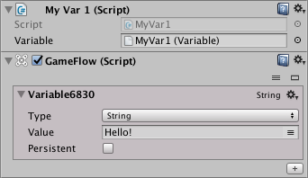

# Communication

The API allows your own scripts to communicate with the GameFlow blocks in case you need to read or write their properties or control their behavior.

## Accessing blocks by reference

The most direct way to access a block of GameFlow from your own script is to pass the script a reference to the block. To do this, we will only have to define a member in our script of the desired type and make sure to drag or choose the corresponding object in the editor.

In the following example, our script defines a member of type Variable that we will access to print its value in the console:

```text
using GameFlow;
using UnityEngine;

namespace MyNamespace {

public class MyVar1 : MonoBehaviour {

    public Variable variable;

    void Start() {
        if (variable) {
            Debug.Log("Value = " + variable.stringValue);
        }
    }
}

}
```

In the Inspector, after the instance of the script MyVar1 we will add a GameFlow component to which we will add a Variable to give it a value \(in the example 'Hello!'\) And finally drag it \(by clicking on the title and moving the mouse\) to the Field 'Variable' of the MyVar1 script, remaining as shown in the image:



If everything is correctly configured, when entering Play mode we should see a message in the console with the value of our variable confirming that our script can access the value of the variable.

## Accessing blocks by identifier

We also have a second way to access GameFlow blocks that consists of searching the block by its type and identifier \(and optionally a search scope\) to obtain its reference.

The following are the static search methods available in the `Blocks` utility class:

| Method |
| :--- |
| `FindBlock<T>(string id)` Search for a block of type T with the id specified in all active GameObjects \(or that have been active at any time\) in the scene. |
| `FindBlock<T>(string id, GameObject go, bool recursive = false)` Search for a block of type T with the specified id but only in the scope of the specified GameObject and optionally \(if we specify recursive = true\) in its entire hierarchy \(that is, in the GameObject children\). In this case, it is not taken into account if the GameObject is active or not. |

In case of success, these methods will return the reference to the first block that meets the specified search requirements. If no block is found, `null` is returned.

In the following example we will access a variable again, but this time instead of explicitly passing its reference to it as in the previous example, we will look for it by its name.

```text
using GameFlow;
using UnityEngine;

namespace MyNamespace {

public class FindVar : MonoBehaviour {

    void Start() {
        Variable variable = Blocks.FindBlock<Variable>("Health");
        if (variable) {
            Debug.Log("Value = " + variable.intValue);
        }
    }

}

}
```

For the example to work, we will need to add a GameFlow component with an Integer variable that we will call "Health", as shown in the image:


If everything is correctly configured, when entering Play mode we should see a message in console with the value of our variable that will confirm that our script finds the variable and can access its value.

## Accessing blocks properties

One of the most frequent reasons to access GameFlow blocks from our scripts is to read or write their properties, something that the API also allows.

In the previous examples we have seen how to read the value of two variables using the properties `stringValue` and`intValue`, but these properties could also be used to modify the value of the variables just by making an assignment.

So, for example, to change the value of the Variable used in the previous example, we could do:

```text
Variable variable = Blocks.FindBlock<Variable>("Health");
// ...
if (variable) {
    variable.intValue = 500;
}
```

The properties available for each block class can be found in the [API Reference](reference.md).

## Executing methods declared in blocks

In addition to accessing the properties, we also have the ability to invoke the public instance methods of any block to govern their behavior from our scripts.

If for example we wanted to stop a Timer block from which we had previously obtained a reference by searching, it would be enough to invoke the appropriate method:

```text
Timer timer = Blocks.FindBlock<Timer>("MyTimer");
// ...
if (timer) {
    timer.Stop();
}
```

The available methods for each block class can be found in the [API Reference](reference.md).

## Built-in Variables

GameFlow includes a series of pre-defined Variable blocks whose particularity is that of having values that are updated dynamically either at run time or at edit time.

The API offers a simple and unified access to the values of all these variables through the properties of the `Builtin` utility class:

| Property | Description | Type |
| :--- | :--- | :--- |
| activeGameObject | Currently selected and focused GameObject | GameObject |
| currentFPS | Current frames per second | float |
| day | Number of the current day of the month | int |
| defaultLanguage | Default language for the application as configured in settings | SystemLanguage |
| deltaTime | Time \(seconds\) that the last frame took to complete | float |
| deviceName | Name of the device in use | string |
| frame | Number of the current frame | int |
| hour | Current hour | int |
| inputAxis | Current value for the input axis | Vector2 |
| inputAxisX | Current value for the horizontal input axis | float |
| inputAxisY | Current value for the vertical input axis | float |
| language | Current language in use | SystemLanguage |
| mainCamera | Reference to the Camera tagged as "Main Camera" | Camera |
| minute | Current minute | int |
| month | Current month | int |
| mouseDelta | Offset from last mouse position | Vector2 |
| mouseDeltaX | Horizontal offset of the last mouse movement | float |
| mouseDeltaY | Vertical offset of the last mouse movement | float |
| mousePosition | Current position \(x,y\) of the mouse cursor | Vector2 |
| mousePositionX | Current horizontal position of the mouse cursor | float |
| mousePositionY | Current vertical position of the mouse cursor | float |
| nativeResolution | Native resolution of the screena | Vector2 |
| screenCenter | Coordinates of the center of the screen | Vector2 |
| screenSize | Current screen resolution | Vector2 |
| second | Current second | int |
| year | Current year | int |

So, for example, to obtain the current position of the mouse we could do:

```text
Vector2 mousePos = Builtin.mousePosition;
```

