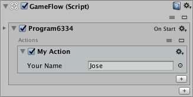

# Custom Actions

In order to create a custom action, two C\# scripts are required:

1. A script extending class `Action` \(or any of its subclasses\) for defining the action properties and implementing the action functionality.
2. An Editor script extending class `ActionEditor` \(or any of its subclasses\) for implementing the action user interface to be shown in the Inspector.

## Wizard

In order to accelerate the creation of the base code for those C\# scripts, GameFlow provides a code generation wizard that you can find under the Assets &gt; Create &gt; GameFlow &gt; Action... menu option.


In this window we can decide the namespace, name and type of the action class, if we want the action to be executed also in Edit mode and the destination folders of the two scripts to be generated once we click on the Create button.

Regarding the type of action \(Action Type\), the available options are the following:

* **Action**: Instant action that starts and ends in the current frame.
* **Time Action**: action based on time whose execution can be extended for several frames.
* **Macro Action**: action that can implement a differentiated execution in time of edition.

  _\*\*_Function\*\*: action that generates a value as a result.

Once the scripts are generated and the compilation is finished, our new action should appear already available in the action selection window:


And of course we can add it to our programs as if it were any other action available as standard:



## Generated code

The code generated for the action script would be this:

```text
using UnityEngine;
using GameFlow;

// An example showing how to implement a basic custom Action.

namespace MyNamespace {

// Help summary is localized according to current system language.
[Help("en", "Action summary.", "context-help-url")]
[Help("es", "Resumen acción.", "url-ayuda-contextual")]

// Prevent the Action from appearing in the Add Component menu.
[AddComponentMenu("")]

public class MyAction : Action {

    // Declare a Variable-friendly property for the action:
    [SerializeField]
    string _yourName;
    [SerializeField]
    Variable _yourNameVar;

    // Define a convenience property getter
    string yourName {
        // Link string value and Variable reference through an extension method
        get { return _yourNameVar.GetValue(_yourName); }
    }

    // Code implementing any setup required by the action
    protected override void OnSetup() {
    }

    // Code implementing the effect of the action
    protected override void OnExecute() {
        // Do something with the declared property
        Debug.Log("Hello, " + yourName);
    }

}

}
```

The first thing we find in this code is an example of the mechanism used in GameFlow to add Variables support to the actions. As we can see, this mechanism is based on the use of the `GetValue()` extension method, which only deals with the final value that the action must use, taking into account whether the user specified a Variable or, on the contrary, wrote a value directly in the specific field to which the property is associated.

Regarding the method `OnExecute()` it is important to explain that it will be executed once for each frame in which the action is still running, which is equivalent to a single time for actions of instant execution, since the action begins and ends in the same frame.

Also indicate that the `OnSetup()` method will always be executed before the `OnExecute()` method but it will do so only in the first frame, making it a perfect method for values ​​initialization purposes that the action will need for its later execution.

Let's see below the generated code for the script corresponding to the Editor part:

```text
using GameFlow;
using UnityEditor;

namespace MyNamespace {

[CustomEditor(typeof(MyAction))]
public class MyActionEditor : ActionEditor {

    // Declare properties exactly as defined in the Action subclass
    protected SerializedProperty _yourName;
    protected SerializedProperty _yourNameVar;

    // Action user interface
    protected override void OnActionGUI() {
        // Draws a Variable-friendly text field for the property in the Inspector
        PropertyField("Your Name", _yourName, _yourNameVar);
    }

}

}
```

In this case it is very important to follow the indications of the comments in terms of defining the `SerializedProperty` members with exactly the same name that were defined in the other script, since GameFlow automatically takes care of initializing the properties saving us the writing of a code that It can be heavy. That is the reason why in this code the properties are only declared.

It is also important to note that both the variety of the `PropertyField()` method used in this example and all the others \(there are many\) are documented in the [ActionEditor](reference.md#actioneditor-class) entry of the GameFlow reference.

## Action Subclasses

The GameFlow API offers a series of subclasses of `Action` that add certain properties and useful methods, and that can be used to accelerate the writing of own actions. They are the following:

| Class | Description |
| :--- | :--- |
| [DrawGizmosAction](reference.md#drawgizmosaction-class) | Action used for drawing Gizmos in the Editor |
| [Function](reference.md#function-class) | Action that returns a result |
| [LimitValueAction](reference.md#limitvalueaction-class) | Action that makes use of a value intended to be limited |
| [ListAction](reference.md#listaction-class) | Action that makes use of a [List](reference.md#list-class) |
| [ListIndexAction](reference.md#listindexaction-class) | Action that makes use of a [List](reference.md#list-class) and an Index property |
| [ListIndexFunction](reference.md#listindexfunction-class) | Similar to `ListIndexAction` but with an additional return value |
| [ListItemAction](reference.md#listitemaction-class) | Action that makes use of a [List](reference.md#list-class) and an item specifier |
| [ListItemFunction](reference.md#listitemfunction-class) | Similar to `ListItemAction`, but with an additional return value |
| [ListItemIndexAction](reference.md#listitemindexaction-class) | Action that makes use of a [List](reference.md#list-class), an item specifier and an Index property |
| [ListItemIndexFunction](reference.md#listitemindexfunction-class) | Similar to `ListItemIndexAction`, but with an additional return value |
| [NumericParameterAction](reference.md#numericparameteraction-class) | Action that makes use of a numeric [Parameter](reference.md#parameter-class) |
| [NumericVariableAction](reference.md#numericvariableaction-class) | Action that makes use of a numeric [Variable](reference.md#variable-class) |
| [ParameterAction](reference.md#parameteraction-class) | Action that makes use of a [Parameter](reference.md#parameter-class) |
| [TimeAction](reference.md#timeaction-class) | Time-based Action |
| [TimeFunction](reference.md#timefunction-class) | Time-based Action that returns a value once finished |
| [TransformAction](reference.md#transformaction-class) | Action that makes use of a `Transform` and some frequently used and related properties |
| [TransformAction2D](reference.md#transformaction2d-class) | Action that makes use of a `Transform` \(for 2D use\) and some frequently used and related properties |
| [ValueAction](reference.md#valueaction-class) | Action that makes use of a Value property |
| [VariableAction](reference.md#variableaction-class) | Action that makes use of a [Variable](reference.md#variable-class) |

## ActionEditor Subclasses

In the same way, the API also offers a subclass of `ActionEditor` for each of the subclasses from which our scripts can inherit to accelerate the writing of the code that will manage the user interface of the action. They are the following:

| Subclasses |
| :--- |
| [DrawGizmosActionEditor](reference.md#drawgizmosactioneditor-class), [FunctionEditor](reference.md#functioneditor-class), [LimitValueActionEditor](reference.md#limitvalueactioneditor-class), [ListActionEditor](reference.md#listactioneditor-class), [ListIndexActionEditor](reference.md#listIndexactioneditor-class), [ListIndexFunctionEditor](reference.md#listindexfunctioneditor-class), [ListItemActionEditor](reference.md#listitemactioneditor-class), [ListItemFunctionEditor](reference.md#listitemfunctioneditor-class), [ListItemIndexActionEditor](reference.md#listitemindexactioneditor-class), [ListItemIndexFunctionEditor](reference.md#listItemIndexFunctioneditor-class), [NumericParameterActionEditor](reference.md#numericParameterActioneditor-class), [NumericVariableActionEditor](reference.md#numericVariableActioneditor-class), [ParameterActionEditor](reference.md#parameterActioneditor-class), [TimeActionEditor](reference.md#timeActioneditor-class), [TimeFunctionEditor](reference.md#timeFunctioneditor-class), [TransformActionEditor](reference.md#transformActioneditor-class), [TransformAction2DEditor](reference.md#transformAction2Deditor-class), [ValueActionEditor](reference.md#valueActioneditor-class), [VariableActionEditor](reference.md#variableActioneditor-class) |

In the reference of each of these subclasses, the different methods of utility that each class provides are detailed.

## Execution at Edit time

The game execution engine of GameFlow is unique in its kind because it allows execution in both Play and Edit modes, which makes possible things like macros or editor utilities written entirely with GameFlow.

In this way, a GameFlow action can:

* Execute the same code either in Play or Edit modes, which would be the default behavior.
* Execute a code in Play mode and a different code -that will have access to the API `UnityEditor` to be able to use things like the`Undo` class- in Edit mode.
* Execute code only in Play mode or only in Edit mode.

In this section we will see how to prepare our actions to be able to provide them with a specific execution in Play mode, and we will do so by studying the code that the action creation wizard generates when we indicate that we want a Macro-type action, specifically the interface that manages the 'Editor' part of the action.

```text
using GameFlow;
using UnityEditor;
using UnityEngine;

namespace MyNamespace {

[CustomEditor(typeof(CustomMacroAction))]
public class CustomMacroActionEditor : ActionEditor {

    // Declare properties exactly as defined in the Action subclass
    protected SerializedProperty _yourName;
    protected SerializedProperty _yourNameVar;

    // Action user interface
    protected override void OnActionGUI() {
        // Draw a text field for the property and its linked Variable property
        PropertyField("Your Name", _yourName, _yourNameVar);
    }

    [InitializeOnLoadMethod]
    static void Init() {
        // Set the delegate that will handle the execution of the action in Edit mode
        SetActionDelegate<CustomMacroAction>(OnExecute);
    }

    static void OnExecute(Action action) {
        // You can do any Editor stuff required by the action:
        Undo.RegisterCompleteObjectUndo(action.gameObject, "CustomMacroAction");
        // Note you can still access action public properties by using casting:
        Debug.Log("Hello, " + (action as CustomMacroAction).yourName + " (executed in Edit mode)");
        // And of course you can execute the default (Play mode) code for the action:
        Execute(action);
    }

}

}
```

There are two fundamental parts to note in this code: 1. The use of the `SetActionDelegate<T>()` method within the `Init()` method to tell GameFlow which method will take care of the execution of the action at edit time. 2. The `OnExecute()` method which is where we implement the specific execution that we want for our action when executed at runtime.

As explained in the comments, it is not only possible to use own methods of `UnityEditor` but we can even return the execution to the subclass of Action, so that we do not have to duplicate code.

Remember also that it is possible to run any program at edit time without having to transform it into a macro or utility using the Execute option in its context menu and that we can repeat the last execution quickly using the keyboard shortcut Alt-0.

For more information about the operation of the mechanism for delegating the execution of actions in Edit mode, consult the entries of the classes [Action](reference.md#action-class) and [ActionEditor](reference.md#actioneditor-class) in the GameFlow reference.

