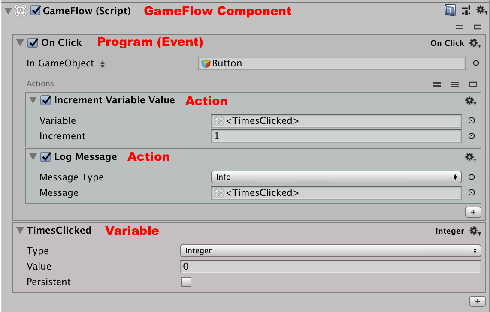
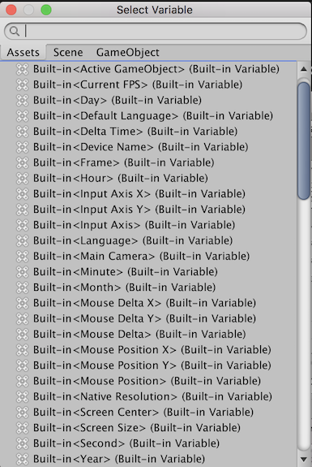
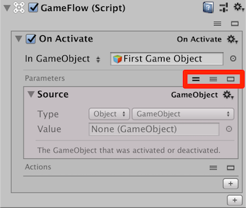

# Basics

Everything in GameFlow 1.x is driven by a single GameFlow [Component](https://docs.unity3d.com/Manual/UsingComponents.html). This Component can be added to different Unity GameObjects, allowing you to easily organize your logic just as you would any other Unity components.

Within the GameFlow Component, you add Variables and Programs. Programs in turn contain Actions.

For example, a standard UI Button might contain an Event Program \(_On Click_\) and a Variable \(_TimesClicked_\).

Within the core GameFlow Component, you will find three basic block types.

* **Data Blocks** store information, including Lists, Localization, Parameters, and Variables.
* **Program Blocks** contain a series of actions, mainly organized by whatever it is that starts the program running.
* **Tool Blocks** store specialized combinations of code and data.

In addition to these core tools, you may find a series of GameFlow pre-packaged Prefabs to be helpful.

### Data Blocks 

Data Blocks consist of four basic types of data. Data Blocks store information in a few common formats, but do not execute code.

Variable, parameter, and list data blocks are used throughout GameFlow. All of the data blocks can be edited visually in the Inspector and/or modified at runtime.

* **Variable** - Stores a single value with a type \(e.g. Integer, String, etc.\)
* **Parameter** - Stores a value with a type, value, display type, and potentially a label.
* **List** - Store a list of values of the same type.
* **Localization** - A specialized version of Variable that returns a different value based on the user’s locale.

GameFlow provides a number of built-in Variables as well.

### Tool Blocks 

Core utility tools cover a few common utility features you’ll you find yourself using frequently. In addition, there are a set of documentation blocks and visual editors.

#### Core Utility Tools 

* **Command** - Used to trigger other programs.
* **Key** - Look for specific input values \(keyboard, mouse or gamepad buttons\)
* **Pool** - Visually define a pool of objects. Pools are often used to assist with memory management, or to manage other limited resources. Missiles or asteroids are examples of objects often managed by a pool.
* **Timer** - Define a timer to trigger timer-expiration related actions. Used in combination with the _On Timer Expired_ program block.

#### Documentation Tools 

* **Description** - Add inline documentation in the Inspector \(no in-game effect\)
* **Note** - Add inline documentation description with an \(optional\) link to a specific GameObject.
* **Seperator** - Add a line in the Inspector to help clarify the logic.

#### Visually Edit Forces, Paths and Arrays 

* **Force** - Visually edit Forces.
* **Path** - Define a series of GameObjects to serve as nodes in path.
* **Ray** - Visually edit a ray.

### Program Blocks 

Program blocks consist of three main types of block.

The vast majority of program blocks are event listeners, all in the format _On Event_. These are generally pretty self-explainatory - for example, _On Click_handles [clicks on UI elements](https://docs.unity3d.com/ScriptReference/UI.Button-onClick.html), _On Collision Enter_ is used to respond to collisions reported by the Physics engine.

The other two types of program blocks are **State Machine**, which allows GameFlow to be used to track simple state machines, and **Macro**, which allows you to define GameFlow scripts that _run in the Editor itself_ - a handy form of automation!

Programs are best understood as collections of Actions. Generally speaking, when a Program is started, it will perform each Action inside, one at a time.

Things start getting more complex \(and interesting\) when Actions include logic statements, such as _If_ or _For Each_, allowing for the expression of interesting logic in a very simple, easy to read manner.  _On State_ Actions can be combined with a **State Machine**.

GameFlow Programs typically include implicit parameters. You can inspect these parameters using icons in the Inspector.

