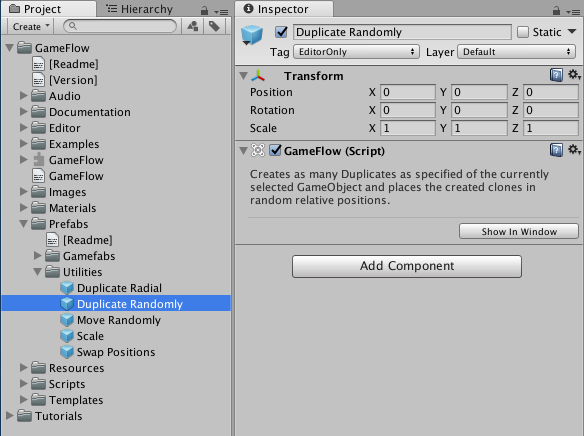
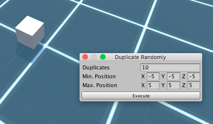
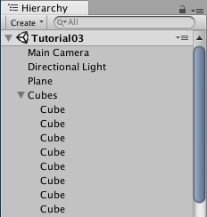
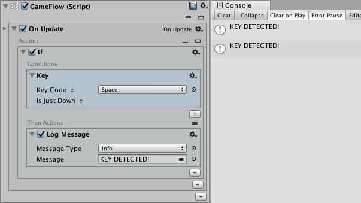

# 03: Simple camera shake effect

In this tutorial we will see how to program a simple shake effect \(rapid random movement\) that we can apply to the main Camera on demand and everytime we press a key.

It is assumed that readers have already completed [Tutorial 01](01.md) and [Tutorial 02](02.md) and they already know some basic GameFlow operations like adding blocks \(Programs, Actions, etc.\), renaming a block and assigning a Variable to a property in an Action.

## 1. Scene setup

Like in previous tutorials, we will need a basic setup for the scene: A Plane \(floor\), a Cube, a Camera and a Light.

1. Add and place the indicated objects where you want in the scene \(see step 1 in [Tutorial 02](02.md) if you need any help\).

2. Now we are going to use a [GameFlow Utility](https://github.com/evasiongames/gameflow/tree/a7421e42f9065333ad7854eb4695e97f45f64d38/docs/guides/utilities/README.md) to make our scene a little bit more interesting, so in the Project, select the GameFlow/Prefabs/Utilities/Duplicate Randomly prefab:

3. If you click on the **Show in Window** button in the Inspector, a little floating window should open:

4. Using the Utility is pretty easy. Just select the cube, change the value of the **Duplicates** property in the Utility window and click on the **Execute** button to see the result:

5. You can close the Utility window now. Also, it would be recommended that you move all the generated cubes into an empty GameObject to keep the hierarchy clean.

## 2. Detecting a key press

We already saw how to do this in [Tutorial 02](02.md) so we'll describe the initial steps briefly.

1. Create an empty GameObject and add it a **GameFlow** component.

2. Add a **On Update** program.

3. Add an **If** action to the program.

4. Add an **Key** condition to the If.

5. In the Key condition, click in the **Key Block** label and choose **Key Code**.

6. Set Space as value for the Key Code.

7. Set the comparison below to **Is Just Down**.

8. Add a **Log Message** to the actions section in the If with some message.

9. Press **Play** and after clicking in the Game view, press the Space key to verify that a message is sent to the Console window and the status bar.

## 3. Shake effect

In this step we are going to implement the actual shake effect.

1. Select the previously created GameObject and add an **On Demand** program.

2. Rename the created program as "Shake".

3. We need to store the original position of the Camera, so first thing is adding a **Get Position** action to the program.

4. Set the value of the "Of Transform" property of the action to "Main Camera" \(you can just drag and drop the Main Camera object into the property\).

5. Create the variable for its output by clicking in the inner + button of the Output field.

6. Rename the Variable as "Original".

7. We want our effect to execute during 2 seconds, so next is adding a **During** action for that to the program.

8. Set the Duration property of the action to 2 seconds.

9. Now add a **Move Randomly** action inside the During.

10. As we want to move the Camera we just drag and drop the Main Camera GameObject into the Transform property of the action.

11. Adjust Min. Position to `-0.3, -0.3, 0` and Max. Position to `0.3, 0.3, 0`. That's right, we won't move the Camera in the Z axis.

12. Toggle the Relative property on and set a short duration \(0.1 seconds is fine\).

13. Finally add a **Set Position** action below.

14. Assign the Main Camera as value for the Transform property.

15. Assign the **\** Variable as value for the Position property.

If you press **Play** you won't see the effect in action yet. That's correct because this is an On Demand program and GameFlow won't execute it automatically like On Start or On Update programs. We'll see how to start the program in the next step.

## 4. Executing the effect

Now we will connect our two programs, so that when we press the key the effect starts executing immediately.

1. In the On Update program, add an **Execute Program** action below the Log Message action \(but still inside of the If action\).

2. Remove the Log Message action \(we no longer need it\).

3. Drag the **\** program into the Program property of the Execute Program action.

If you press **Play** you should now see the effect in action everytime you press the Space key.

## 5. Fixing the effect

Bad news is our effect has a little bug that only exposes when you press the Space key repeatly while the effect is in execution and that causes the position of the Camera to change slightly after several executions. You can see this if you check the values of the `<Original>` variable during Play mode.

The reason of the error is that everytime we execute the effect our first action is getting the current position of the Camera as its original position and that's a wrong assumption because we can't guarantee that the effect is not already in execution or in other words, that the Camera is not in the middle of a "shake".

So, let's see how to fix this little bug:

1. Select the On Update program and press Return \(or use its context menu &gt; Insert New\) to insert a new block above it.

2. Add an **On Start** program this time.

3. Drag the Get Position action in the Shake program into the On Start program.

And that's it. Thanks for following this tutorial.

## 

[Víctor Valenzuela](https://twitter.com/v4lv1k)

