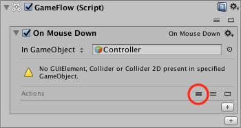

# 04: Point and Click

This is a simple tutorial showing you how to program a simple point and click behaviour that will allow you to move a character just by clicking in the desired destination.

It is assumed that you have already completed the previous tutorials and know some basic GameFlow operations like adding blocks \(Programs, Actions, etc.\), renaming a block or assigning a Variable to a property in an Action.

## 1. Scene setup

As usual first thing to do is setting up the objects we will need in the scene. For this tutorial we will use: A Plane \(floor\), a Capsule, a Camera and a Light.

1. Add the indicated objects to the scene \(see step 1 in [Tutorial 02](02.md) if you need any help\).

2. Make sure that the position is set to `0, 0, 0` and the scale is set to `10, 1, 10` to have a greater area where to click.

3. Set the initial position of the Capsule to `0, 1, 0` so it is over the plane.

## 2. Getting the position

In order to get the world 3D position where we clicked the mouse we need to use a technique called "Raycasting" consisting in intersecting our objects with a imaginary ray to calculate the intersection of the ray with the object.

GameFlow includes several actions to use raycasting in sophisticated ways, but in this tutorial we won't use them. Instead, we will rely on an nice action which will make all the work for us.

1. Create an empty GameObject and rename it as Controller.

2. Add a **GameFlow** component.

3. Add an **On Mouse Down** program and click in the **= Icon** \(Toggle Parameters\) so we can see the parameters that we have available for this program:

> Don't worry about the warning message, it's correct.

4. Set the Plane GameObject as listening target \(that is, the 'In GameObject' field\) for the Mouse Down event. The warning message is now gone:

5. Now add a **Get World Point From Screen Point** action.

6. This action has a 2D Screen Point \(Point and Position is the same here\) property and if you pay attention the `<Mouse Position>` program parameter is exactly that. So just drag the parameter into the field.

7. Now, simply create the Output variable and rename it. You can rename the Variable just pressing F2 while the Output field is focused:

8. If you press Play and click anywhere on the plane \(in the Game view\), you should see the `<Position>` variable getting different values for its X, Y and Z components and meaning that the program is working.

## 3. Moving the character

In this step we will smoothly move the character to the position calculated in the previous step.

As we will be using a time-based action \(Move\) we will need to create a new program of type On Demand that can execute asynchronously.

For more information on this, see the [Programs](https://github.com/evasiongames/gameflow/tree/a7421e42f9065333ad7854eb4695e97f45f64d38/docs/guides/programs/README.md) guide.

1. Select the Controller GameObject.

2. Add an **On Demand** program below the Position variable.

3. Add a **Move** action to the program.

4. As 'Transform' for the Move action indicate the Capsule GameObject.

5. As 'To Position' indicate the `<Position>` variable:

6. Now, we just need to add a **Restart Program** to the On Mouse Down program to execute this On Demand program.

7. If you press play and click anywhere on the plane \(in the Game view\), the Capsule should move to the clicked position. However, the Capsule is now half inserted into the floor and that's not exactly what we wanted to achieve. So let's see how to fix it.

## 4. Fixing the position

So the problem is that we are indicating the Capsule to move to the point where we clicked, but we don't really want that because the Capsule has already the correct Y position.

So, in order to fix the position all we have to do is set the Y to a fixed value after getting the position. This is pretty straightforward:

1. In the On Mouse Down, insert a **Set Y** action below the Get World Point From Screen Point action.

2. As Vector 3 specify the `<Position>` variable.

3. Set the Value to 1:

Press Play and that's it!

## 

[Jose Moreno 'Xeleh'](https://twitter.com/xeleh)

