# GameFlow Tutorial 2
## Moving a cube with Keys and Forces
*By [Víctor Valenzuela](https://twitter.com/v4lv1k)*

In this tutorial we will see how to move a cube with the cursor keys. We will detect keypresses using the Key blocks and we will add movement using the Force blocks.

## 1. Scene setup

First we must setup our scene. Apart from the default Main Camera and Light, we only need a plane \(floor\) and a cube:

1. Create a new scene: File menu &gt; New Scene

2. Add a plane: GameObject menu &gt; 3D Object &gt; Plane

3. Set the plane position to: `0, 0, 0`

4. Set the plane scale to: `4, 1, 4`

5. Find the Ground material in GameFlow/Materials and drag it into the plane.

6. Add a cube: GameObject menu &gt; 3D Object &gt; Cube

7. Set the cube position to: `0, 0.5, 0`

8. Select the Main Camera.

9. Align it with the Scene: GameObject menu &gt; Align with View

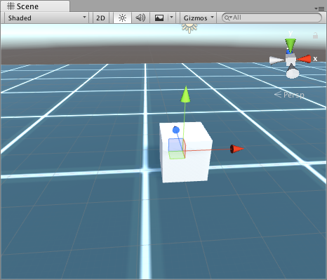

## 2. Adding a Program

In order to move our cube we will need to query the state of the cursor keys and that's something we need to do continuously and every frame. The **On Update** program is the perfect one for the job, so let's add it:

1. Create a new empty GameObject, rename it as Controller.

2. In the Inspector, click on the **Add Component** button.

3. Type `Gameflow` and press Return to add the component.

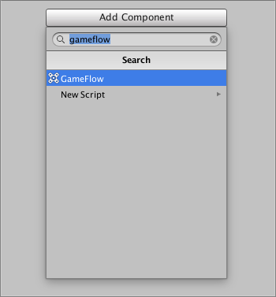

4. In the Inspector, click on the \[＋\] button in the GameFlow component.

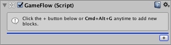

5. Select the **On Update** program in the block in the selector window and press Return \(double click also works\).

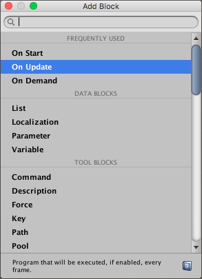

## 3. Detecting a key press

Now we're adding some conditional actions so we can detect the cursor keys and start doing something.

1. Select the Controller GameObject created in the previous step.

2. Click the \[＋\] button inside the On Update program.

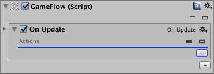

3. Type `If` in the selector window and press Return to add the action.

4. Another selector window is automatically open allowing you to select a Condition, choose the Key condition, press Return to add it and Escape to close the window.

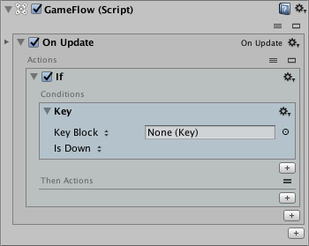

5. Now click in the 'Key Block' label to see more options and choose 'Key Code' instead.

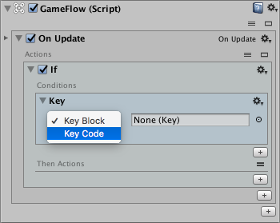

6. You will see that you can now choose the key code directly. Choose 'Up Arrow'.

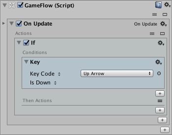

7. Finally add a Log Message action inside the If so we can check the key press is effectively detected.

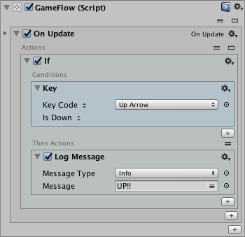

8. If you click the Play button, you should see a message in the Console every time you hit the Up cursor key. Remember to click in the Game view to enable input on it.

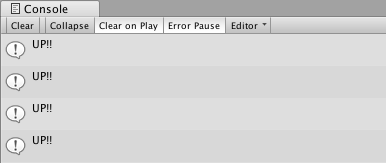

## 4. Adding a Force

In order to move our cube we will need to add some force to it. In GameFlow we have the Force blocks for that.

1. Select the Controller GameObject.

2. In the Inspector, click on the \[＋\] button \(the one at the bottom\) in the GameFlow component.

3. Choose Force in the block selector and close the window.

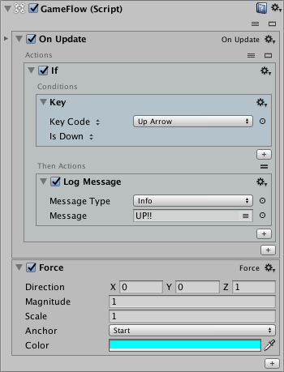

4. Rename the created Force block to "Up".

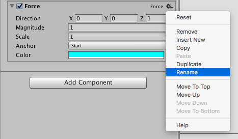

5. Now click on the \[＋\] button under the Log Message action.

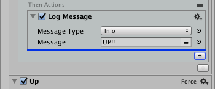

6. Add an Add Force action.

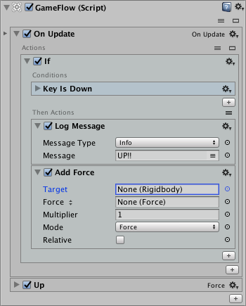

7. Now notice that the action is asking for a Target of type Rigidbody. That means that we will have to add a Rigidbody component to our Cube to be able to assign it as Target of the action.

8. After adding the Rigidbody we should be able to select it in the object selector window.

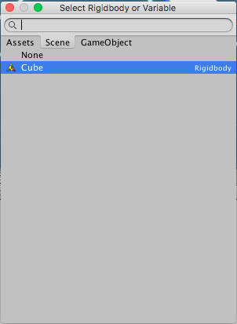

9. Drag the Force block into the Force field of the action. You can also select it with the object selector if you prefer that way.

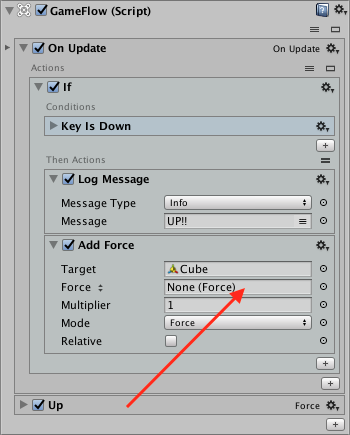

10. Finally set the Multiplier to a value like 30 so that we can see some real movement.

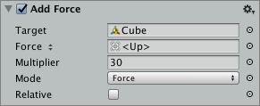

If you press Play you should be able to move the cube forward using the Up cursor key. Please feel free to remove the Log Message action as it is no longer required.

## 5. Moving in the 4 directions

So, now that we can move the cube forward we can easily do the same for the other 3 directions. First let's create the Forces:

1. Select the Controller GameObject.

2. Duplicate the Up force 3 times using the context menu option.

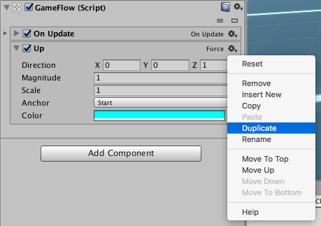

3. Rename and modify the new Force blocks like in the image.

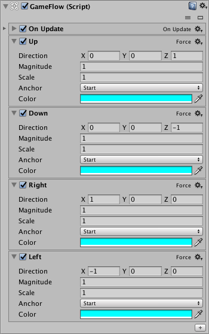

4. If you set the position of the Controller GameObject to: 0, 0.5, 0 you should see a visual representation of the Forces in the Scene like this:

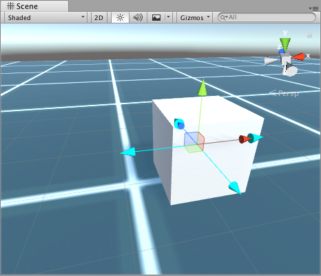

5. Once we have the Forces, it's time to duplicate the If actions in our On Update program to control the other cursor keys:

6. Click the If action title to focus it and use the Duplicate action in the context menu to duplicate 3 times.

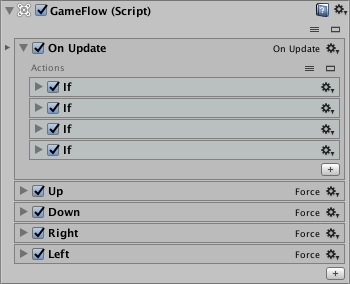

7. Now edit the Key Code value in the Key Condition and the Force in the Add Force action, like this:

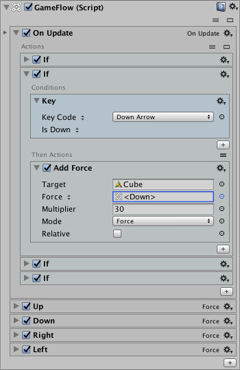

8. Repeat for the Left and Right keys.

Press Play and verify that you can now move the cube in the 4 directions by pressing the cursor keys.

## 6. Limiting the velocity

Our cube is moving but as you can see the movement is too accelerated, so we need to fix that.

1. Select the Controller GameObject.

2. Add a Limit Velocity action after your last If.

3. Set the Target of the action to be our Cube.

4. Set the Min. Velocity to 0 and the Max. Velocity to 5.

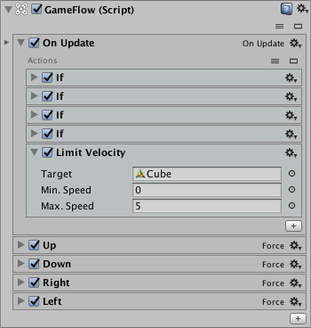

And that's all. Contratulations for completing this tutorial!
